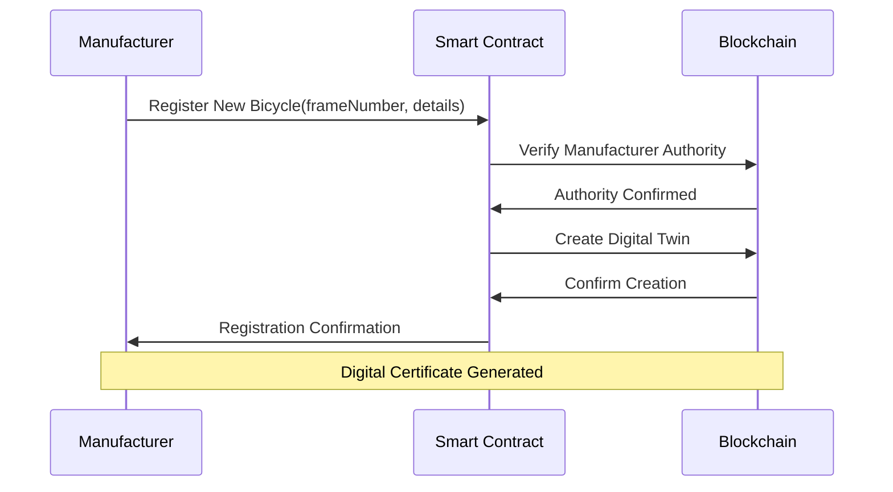
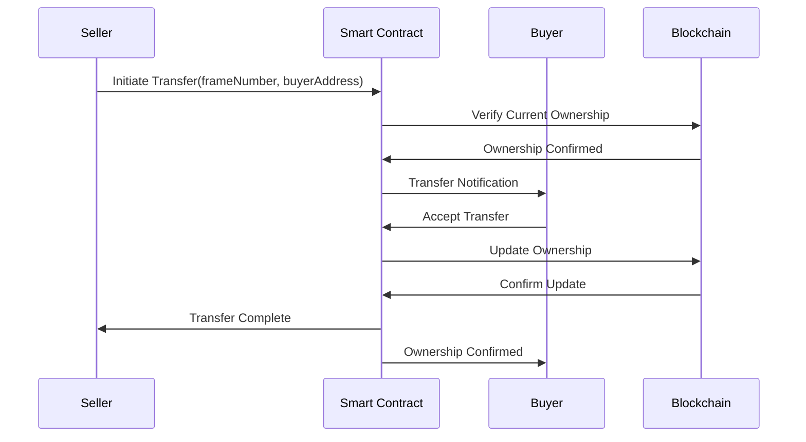
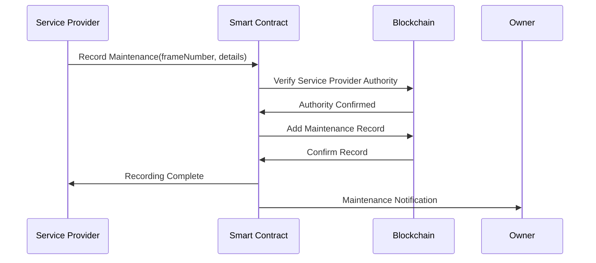
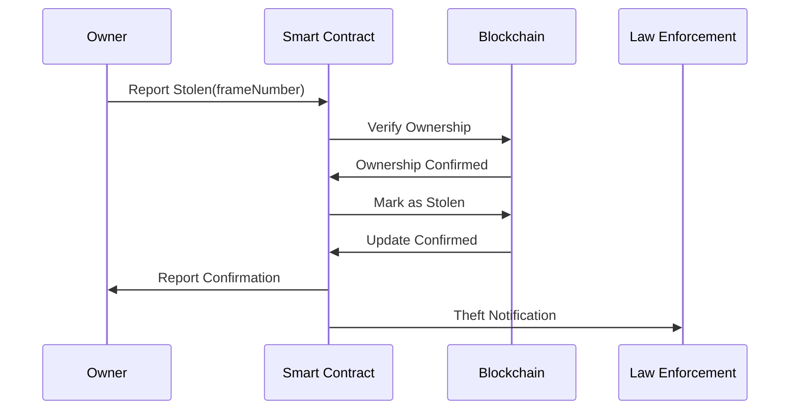

# CycleChain: Blockchain-Based Bicycle Authentication & Tracking System

## Overview

CycleChain is a decentralized application built on the Neo blockchain that provides an immutable and transparent system for bicycle registration, ownership tracking, and theft prevention. By creating digital twins of physical bicycles, we enable secure ownership verification and maintenance tracking throughout a bicycle's lifecycle.

## Problem Statement

- Global bicycle theft is a significant issue, with millions of bikes stolen annually
- Lack of standardized verification methods in the used bicycle market
- Difficulty in verifying maintenance history and component authenticity
- Challenge in tracking stolen bikes across jurisdictions
- No unified system for manufacturers, retailers, and owners

## Solution

CycleChain creates a comprehensive ecosystem where each bicycle has a digital identity on the blockchain, enabling:

- Manufacturer registration of new bicycles
- Secure ownership transfers
- Maintenance history tracking
- Stolen bicycle reporting and tracking
- Component change verification

## System Architecture

### Core Components

1. Smart Contracts

   - Bicycle Registration Contract
   - Ownership Management Contract
   - Maintenance Record Contract
   - Theft Registry Contract

2. User Interfaces

   - Manufacturer Portal
   - Service Provider Dashboard
   - Owner Mobile App
   - Law Enforcement Interface

3. Integration Layer
   - API Gateway
   - Event Listeners
   - External Service Connectors

## Sequence Diagrams

### 1. Bicycle Registration Process



### 2. Ownership Transfer Process



### 3. Maintenance Recording Process



### 4. Theft Reporting Process



## Technical Implementation

### Smart Contract Functions

```solidity
// Core functions in the smart contract
function registerBicycle(string frameNumber, BicycleDetails details)
function transferOwnership(string frameNumber, address newOwner)
function recordMaintenance(string frameNumber, MaintenanceDetails details)
function reportStolen(string frameNumber)
function verifyOwnership(string frameNumber) returns (OwnershipDetails)
```

### Data Structures

```solidity
struct Bicycle {
    string frameNumber;
    string manufacturer;
    string model;
    uint256 manufactureDate;
    address currentOwner;
    bool isStolen;
    MaintenanceRecord[] maintenanceHistory;
    ComponentChange[] componentHistory;
}
```

## User Interface Mockups

### Mobile App Features

1. Scan QR/NFC for instant verification
2. View bicycle details and history
3. Transfer ownership
4. Report theft
5. View maintenance records
6. Schedule service

### Service Provider Dashboard

1. Record maintenance
2. Verify bicycle authenticity
3. Update component changes
4. Access service history

## Development Roadmap

### Phase 1: Core Development (Week 1-2)

- Smart contract development
- Basic API implementation
- Mobile app prototype
- Integration testing

### Phase 2: Enhanced Features (Week 3-4)

- Service provider dashboard
- Law enforcement interface
- Advanced search capabilities
- Analytics dashboard

### Phase 3: Integration & Testing (Week 5-6)

- Security auditing
- Performance optimization
- User testing
- Documentation

## Business Model

1. Registration fees from manufacturers
2. Transaction fees for ownership transfers
3. Service provider subscriptions
4. API access for third-party integrations
5. Premium features for end users

## Market Opportunity

- Global bicycle market size: $97 billion (2024)
- Annual bicycle theft losses: $1 billion+
- Growing e-bike market: 40% CAGR
- Increasing focus on sustainable transportation

## Team Requirements

1. Blockchain Developer (Smart Contracts)
2. Frontend Developer (Web/Mobile)
3. Backend Developer (API/Integration)
4. UI/UX Designer
5. Project Manager

## Success Metrics

1. Number of registered bicycles
2. Active users (manufacturers, service providers, owners)
3. Successful theft recoveries
4. Transaction volume
5. API integration adoptions

## Next Steps

1. Form development team
2. Create detailed technical specification
3. Develop MVP
4. Begin manufacturer partnerships
5. Launch pilot program
